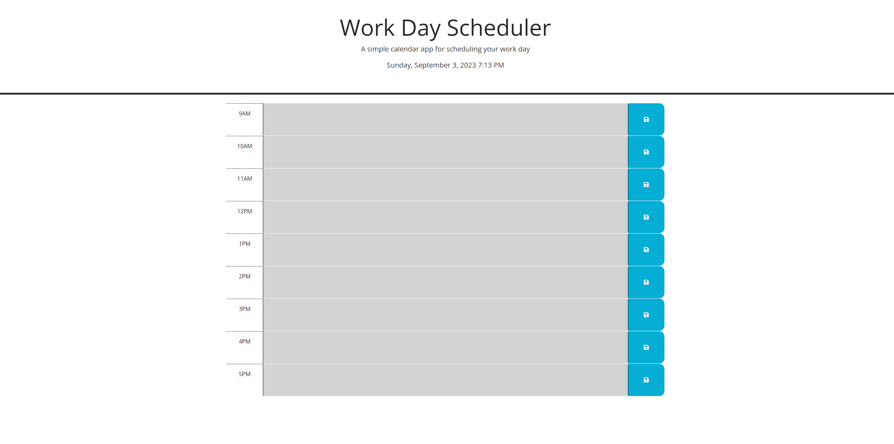

# Work Schedular!

## Description

My motivation for this project was to help users plan and see when events are going to be taking place. I built this to show my confidence with using time and applying time in for loops to possible employers while also helping users at the same time. This will help people organize and stay organized when using this website. I learned the how easy for loops can really change the feel of a html.

## Table of Contents (Optional)

N/A

## Installation

N/A

## Usage

Helps the user manage there time and keep an idea of upcoming events and projects.

## Credits

N/A

## License

N/A

## Badges

Badges aren't necessary, per se, but they demonstrate street cred. Badges let other developers know that you know what you're doing. Check out the badges hosted by [shields.io](https://shields.io/). You may not understand what they all represent now, but you will in time.

## Features

This project will have a for loop that will automatically update colors based on time and save events for the future.

## How to Contribute

Positive feedback!

## Tests

Click the save button

## Links and SS

[link](https://github.com/JMADA257/Work-Schedular)
[link]

